# 2025年排名前25的VPS主机盘点(最新整理)

刚开始折腾网站或者跑项目的时候，最头疼的就是服务器。要么是共享主机太慢，动不动就崩溃；要么是看着一堆复杂的服务器配置单，什么CPU、内存、带宽，感觉像在看天书，生怕一不小心就买了又贵又不好用的。选一个稳定、速度快、价格又不离谱的VPS主机，能省下大半的折腾时间和精力，让你能真正专注于业务本身，而不是天天跟服务器“打架”。

本文就帮你整理了25家在2025年表现不错的VPS主机服务商，从超高性价比的入门选择到性能强悍的企业级方案都有覆盖，希望能帮你快速找到最适合自己的那一款。

## **[RackNerd](https://www.racknerd.com/)**

超高性价比，适合新手入门和预算有限的用户。

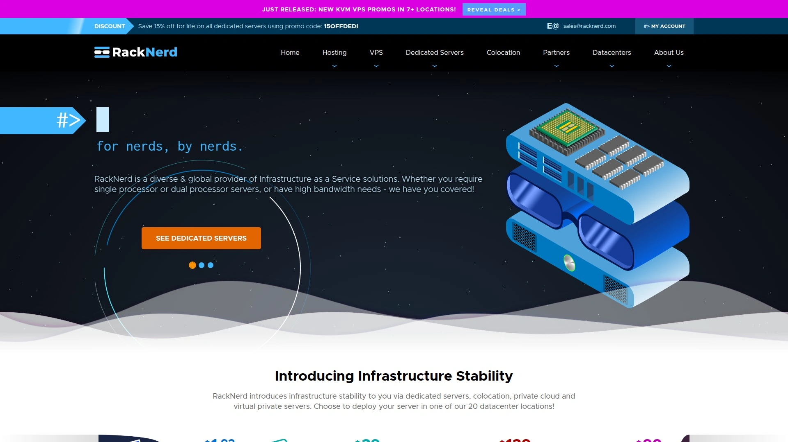

RackNerd以其极具竞争力的价格在圈内闻名，尤其是在各种促销活动期间，经常能以非常低的价格拿到不错的配置。它采用KVM虚拟化技术，提供几乎等同于独立服务器的完整资源控制权。

* **核心特点**：
  * **多数据中心**：在全球拥有超过20个数据中心，包括洛杉矶、圣何塞、西雅图、达拉斯、芝加哥、纽约等，方便你选择离用户最近的节点，降低延迟。
  * **强大的硬件**：服务器采用英特尔至强（Intel Xeon）处理器和纯SSD存储，确保了不错的处理能力和磁盘I/O性能。
  * **即时开通**：下单后服务会立即激活，无需等待，可以马上开始使用.
* **适用场景**：个人博客、小型电商网站、开发测试环境，或者任何需要多个低成本服务器来构建集群应用的场景。
* **推荐理由**：如果你在寻找一个“便宜大碗”的VPS，RackNerd绝对是绕不开的选择。它极大地降低了使用VPS的门槛，让你用很低的成本就能开始自己的项目。

## **[Liquid Web](https://www.liquidweb.com/dedicated-server-hosting/)**

提供顶级全管理服务的高端主机服务商。

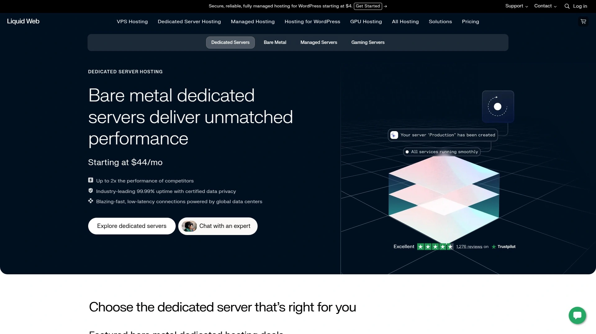

Liquid Web专注于为需要高性能和专业技术支持的企业提供服务，跳过了传统的共享主机业务，直接提供VPS、云主机和独立服务器等高端解决方案。

* **服务亮点**：
  * **卓越的技术支持**：以“The Most Helpful Humans in Hosting®”为口号，提供24/7的全天候专家支持，响应速度极快。
  * **100%在线时间保证**：对网络和电力提供100%的SLA保证，确保你的业务持续在线。
  * **全管理服务**：从服务器监控、安全加固到软件更新，都有专业团队负责，让你完全不用操心运维问题。
* **价格定位**：属于高端市场，价格相对较高，但你获得的是与之匹配的性能、稳定性和无忧服务。

## **[Hostinger](https://www.hostinger.com/vps-hosting)**

预算友好，功能全面，广受好评的入门级选择。

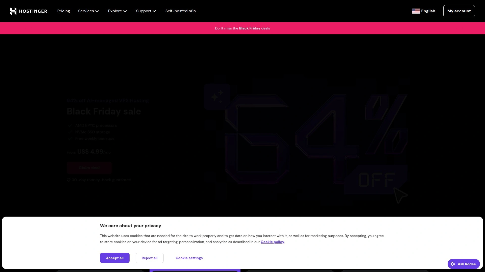

Hostinger以其极具吸引力的价格和简单易用的操作界面，成为许多初学者和小微企业的首选。它的VPS方案在提供低价的同时，也保证了不错的基础功能和性能。

* **核心功能**：
  * **易用的控制面板**：自主研发的hPanel控制面板非常直观，即使是新手也能轻松管理服务器。
  * **AI防火墙与备份**：提供AI驱动的防火墙和每周自动备份，为数据安全提供了一层保障。
  * **全球数据中心**：在全球多个地区设有数据中心，有助于提升网站的访问速度。
* **适用人群**：个人开发者、学生、小型项目或任何在预算有限但又希望获得可靠服务的人。

## **[IONOS](https://www.ionos.com/)**

性价比高，配置灵活，安全性强的德国老牌主机商。

IONOS（前身为1&1）提供了兼具性能和价格优势的VPS方案。它允许用户根据需求高度自定义服务器配置，并且所有数据中心都通过了ISO 27001认证，安全性有保障。

* **技术优势**：
  * **强大的硬件选项**：提供英特尔至强和AMD EPYC处理器，以及最高可达48TB的RAID保护存储。
  * **无限流量**：所有方案都提供1Gbps带宽和不限流量的配置，非常适合大流量网站。
  * **安全套件**：内置DDoS防护和IP防火墙，为服务器提供基础的安全防护。
* **推荐理由**：如果你需要一个价格透明、配置灵活且注重安全的欧洲主机商，IONOS是个非常不错的选择。

## **[InMotion Hosting](https://www.inmotionhosting.com/dedicated-servers)**

以卓越性能和顶级客户支持著称。

InMotion Hosting专注于提供高性能的托管解决方案，其服务器经过专门优化，加载速度飞快。他们还提供“VIP式”的上手指导，帮助用户顺利迁移和配置。

* **突出特点**：
  * **99.99%超高在线率保证**：这是业内少有的高标准承诺，对于那些一秒钟都不能宕机的关键业务来说至关重要。
  * **免费网站迁移**：提供免费的网站迁移服务，省去了手动搬家的烦恼。
  * **强大的技术支持**：提供24/7的美国本土技术支持，随时解决你遇到的问题。

## **[Hostwinds](https://www.hostwinds.com/)**

高度可配置，提供企业级稳定性的服务商。

Hostwinds允许用户在购买前就详细定制自己的服务器硬件，从CPU、内存到存储类型和RAID阵列都可以自由选择。

* **亮点**：
  * **99.9999%在线率保证**：提供了极其严格的服务等级协议（SLA），体现了其对基础设施稳定性的信心。
  * **丰富的IP资源**：默认提供多个独立IP地址，远超大多数竞争对手。
  * **快速硬件更换**：承诺在一小时内更换出现故障的硬件，最大限度减少停机时间。

## **[A2 Hosting](https://www.a2hosting.com/)**

为速度而生，适合对性能有极致要求的用户。

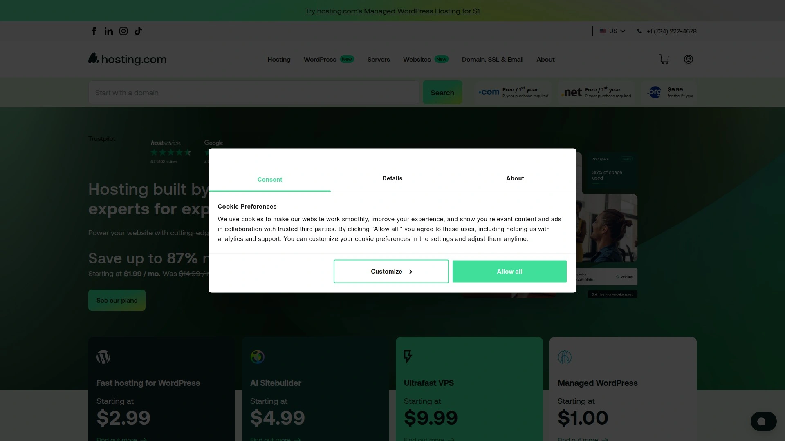

A2 Hosting以其“Turbo”服务器而闻名，这些服务器采用NVMe存储和更优化的软件配置，旨在提供最快的网站加载速度。

* **核心优势**：
  * **Turbo服务器**：提供比传统SSD快数倍的NVMe存储，显著提升数据读写速度。
  * **开发者友好**：提供完全的root权限，支持多种操作系统和开发环境，非常适合技术人员。
  * **随时退款保证**：提供“Anytime Money-Back Guarantee”，让用户可以无风险试用。

## **[DigitalOcean](https://www.digitalocean.com/)**

开发者首选，API驱动的云VPS平台。

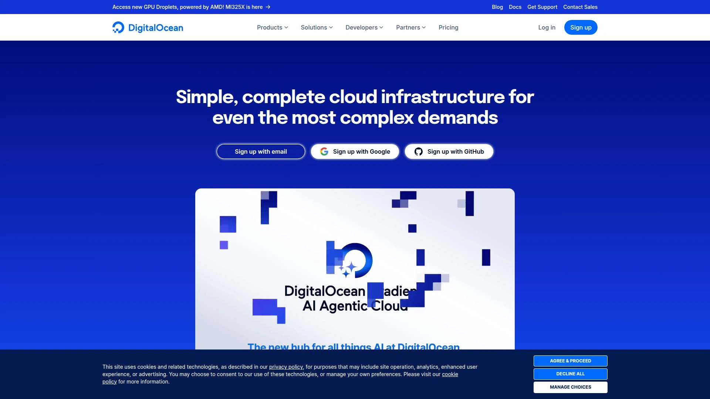

DigitalOcean以其简洁的界面、强大的API和为开发者量身打造的工具生态而备受喜爱。它不是传统意义上的“主机商”，更像是一个灵活的云基础设施平台。

* **特点**：
  * **按需计费**：可以按小时计费，用多少付多少，非常适合需要弹性伸缩资源的项目。
  * **一键部署应用**：通过Marketplace，可以一键安装WordPress、Docker、Node.js等常用应用。
  * **强大的社区和文档**：拥有非常活跃的开发者社区和海量的优质教程，遇到问题很容易找到解决方案。

## **[Kamatera](https://www.kamatera.com/)**

提供极致灵活性和全球部署能力的云服务商。

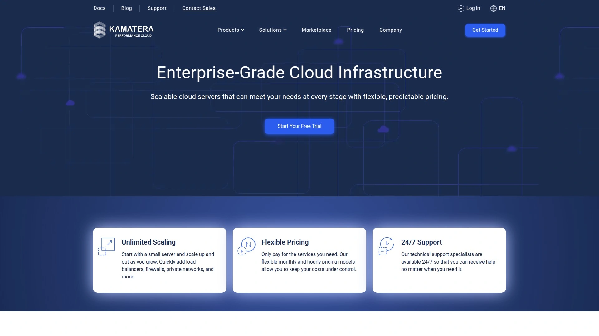

Kamatera提供高度可定制的云VPS，你可以在几秒钟内启动一台服务器，并随时根据需求增减CPU、内存、存储等资源，无需停机。

* **优势**：
  * **全球数据中心**：在全球拥有13个数据中心，可以实现真正的全球覆盖。
  * **灵活的计费模式**：支持按分钟、按小时或按月计费，成本控制非常灵活。
  * **30天免费试用**：提供30天的免费试用期，让你可以充分测试其性能和服务。

## **[GoDaddy](https://www.godaddy.com/)**

全球最大的域名注册商，提供适合新手的VPS方案。

GoDaddy以其简单明了的设置流程和可靠的客户支持而成为许多新手的入门选择。它的VPS方案旨在让没有太多技术背景的用户也能轻松上手。

* **适合新手**：
  * **简单的设置**：提供引导式的设置过程和直观的控制面板。
  * **可靠的支持**：提供24/7的电话和在线聊天支持，随时帮助解决问题。
  * **资源监控**：提供易于理解的资源监控仪表盘，让你清楚地了解服务器的使用情况。

## **[Bluehost](https://www.bluehost.com/)**

WordPress官方推荐，对WP网站优化极佳。

Bluehost是WordPress官方推荐的三大主机商之一，其服务器环境对WordPress网站进行了深度优化，能提供更好的性能和兼容性。

* **特点**：
  * **增强的cPanel**：在cPanel的基础上进行了改进，集成了更多针对WordPress的管理工具。
  * **多服务器管理**：允许你在一个账户下轻松管理多个VPS或独立服务器。
  * **免费SSL证书**：所有方案都包含免费的SSL证书，保障网站数据传输安全。

## **[HostGator](https://www.hostgator.com/)**

拥有近20年历史，以稳定和可扩展性著称的老牌主机商。

HostGator以其可靠的基础设施和出色的客户支持而闻名，为超过200万个网站提供服务。它的服务器方案能够轻松应对业务增长带来的流量压力。

* **优势**：
  * **完全的服务器控制**：提供完整的root访问权限和即时的资源扩展选项。
  * **高可靠性**：通过Tier 3级别的数据中心保证了极高的在线时间。
  * **免费迁移服务**：为基于cPanel的服务器提供免费的迁移服务。

## **[Namecheap](https://www.namecheap.com/)**

以高性价比和可靠性能闻名的服务商。

Namecheap最初以域名服务闻名，现在其主机服务也因其实惠的价格和可靠的性能而受到认可。其服务器采用英特尔至强和AMD EPYC处理器，硬件配置强大。

* **亮点**：
  * **免费备份存储**：提供高达500GB的免费备份空间，为数据安全加了一道锁。
  * **灵活的管理选项**：提供包括全管理在内的多种服务器管理级别。
  * **美国数据中心**：数据中心位于美国，能为北美用户提供快速的访问体验。

## **[InterServer](https://www.interserver.net/)**

提供价格锁定保证，极具性价比的定制化服务器。

InterServer自家拥有并运营数据中心，这使得它在提供高度定制化服务的同时，还能保持极具竞争力的价格。

* **独特价值**：
  * **价格锁定保证**：承诺你首次购买的价格就是你终身续费的价格，再也不用担心续费涨价。
  * **快速部署**：承诺在4小时内交付服务器，且无设置费。
  * **丰富的OS选择**：支持超过十几种操作系统和多种控制面板。

## **[DreamHost](https://www.dreamhost.com/)**

WordPress官方推荐，提供无限制带宽的独立主机商。

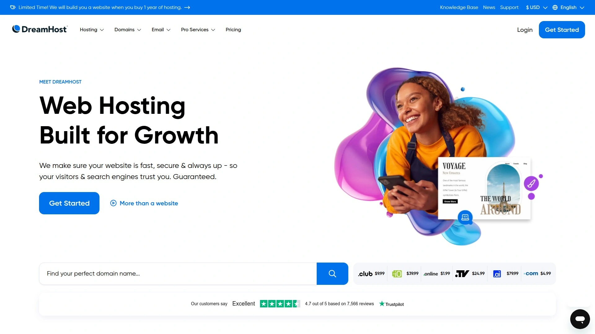

DreamHost是另一家获得WordPress官方推荐的主机商，以其对开源社区的支持和慷慨的资源配置而著称。

* **特点**：
  * **无限制带宽**：其VPS方案提供不限制的流量，非常适合内容型网站。
  * **100%在线时间保证**：提供SLA保证，确保网站的稳定性。
  * **自主研发的控制面板**：使用自家的控制面板，设计简洁，易于管理。

## **[GreenGeeks](https://www.greengeeks.com/)**

专注于环保的绿色能源主机服务商。

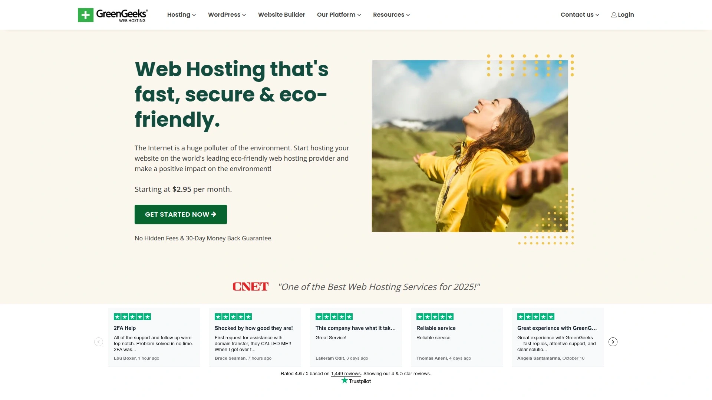

GreenGeeks是一家致力于环保的主机公司，它通过购买三倍于其消耗量的风能积分，来抵消其服务器产生的碳足迹。

* **环保特色**：
  * **300%绿色能源**：是业内最环保的主机商之一。
  * **针对性能优化**：采用LiteSpeed、LSCache、MariaDB等最新技术来优化性能。
  * **专业支持**：提供24/7的专业技术支持。

## **[ScalaHosting](https://www.scalahosting.com/)**

提供创新自研控制面板SPanel的托管VPS服务商。

ScalaHosting以其创新的SPanel而与众不同。SPanel是一个专为VPS设计的轻量级、功能强大的cPanel替代品，并且完全免费。

* **创新之处**：
  * **免费SPanel**：提供了一个强大的、无需额外付费的服务器管理面板。
  * **SShield安全监控**：实时监控服务器安全，能够阻止99.998%的网络攻击。
  * **透明和高性能**：在托管VPS领域以其高透明度和卓越性能脱颖而出。

## **[MonoVM](https://www.monovm.com/)**

提供全球35+节点的Linux VPS，覆盖范围广。

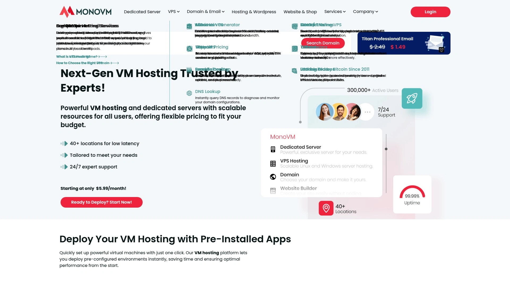

MonoVM以其广泛的服务器节点选择和高性价比的Linux VPS方案而受到关注。它承诺99.9%的在线时间，并提供24/7的客户支持。

* **优势**：
  * **全球节点**：在全球超过35个地点提供服务器，方便用户进行全球业务部署。
  * **专用资源**：提供完全专用的CPU和内存资源，不受“邻居”干扰。
  * **SSD缓存**：在欧洲节点提供SSD缓存，加速磁盘性能。

## **[Atlantic.Net](https://www.atlantic.net/)**

拥有超过30年历史，提供合规性认证的可靠云VPS。

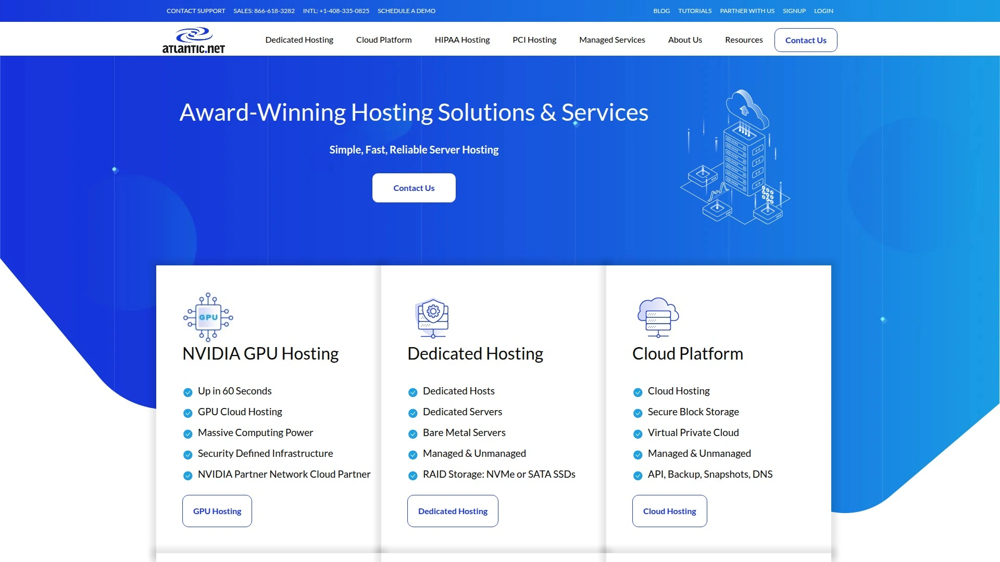

Atlantic.Net是一家经验丰富的基础设施提供商，其服务符合HIPAA、PCI等多种安全合规标准，非常适合对数据安全和合规性有严格要求的行业。

* **特点**：
  * **合规性**：为医疗、金融等行业提供符合监管要求的托管环境。
  * **按秒计费**：提供精细到秒的计费模式，成本控制极其灵活。
  * **100%在线时间SLA**：提供可靠的在线时间保证。

## **[Cherry Servers](https://www.cherryservers.com/)**

专注于提供裸金属服务器和高性价比专用服务器。

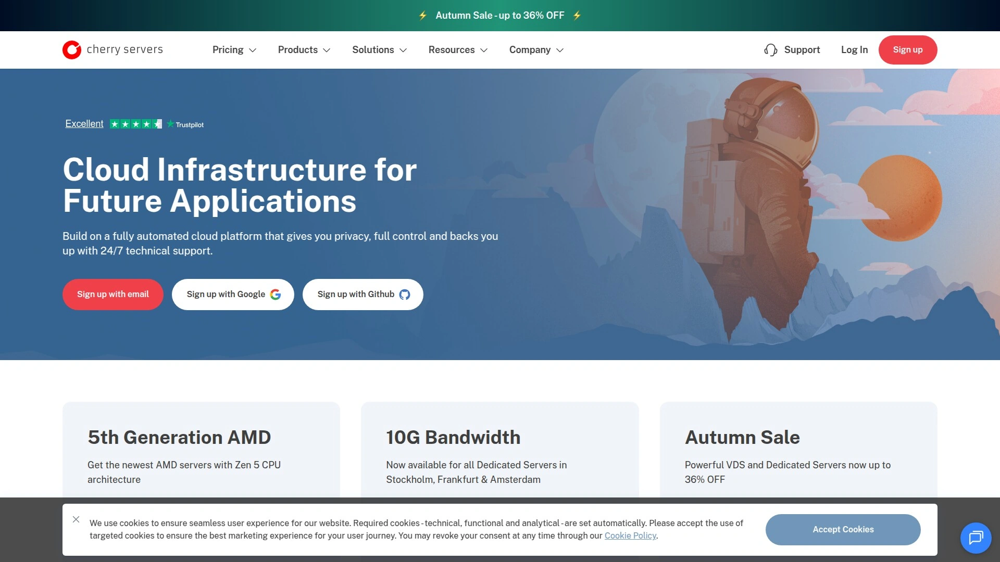

Cherry Servers主打印分钟计费的裸金属云服务器，让你既能享受到云的灵活性，又能获得物理服务器的全部性能。

* **服务**：
  * **裸金属云**：提供完全专用的物理服务器资源，按需部署。
  * **免费DDoS防护**：所有服务器都包含基础的DDoS攻击防护。
  * **强大的API**：提供完整的API，方便进行自动化运维。

## **[HostPapa](https://www.hostpapa.com/)**

以强大的硬件和优质的客户服务为特色。

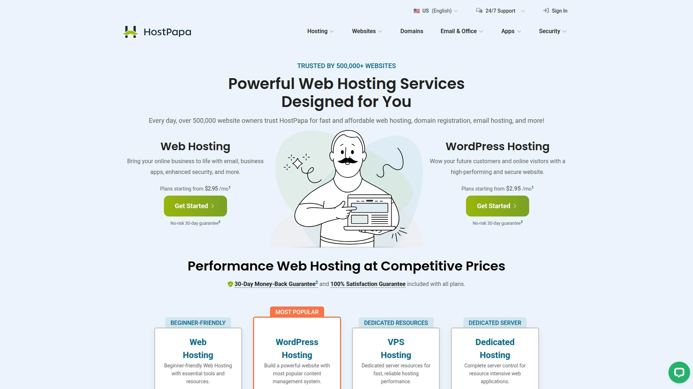

HostPapa提供采用现代AMD Ryzen和Intel Xeon处理器的服务器，硬件配置非常强大，能够轻松应对资源密集型应用。

* **亮点**：
  * **强大的硬件**：最高可提供44核CPU和256GB内存。
  * **高客户满意度**：拥有高达97%的支持满意率。
  * **30天满意度保证**：为用户提供了一个安全的试用期。

## **[SSD Nodes](https://www.ssdnodes.com/)**

提供基于年付的超大配置、高性价比VPS。

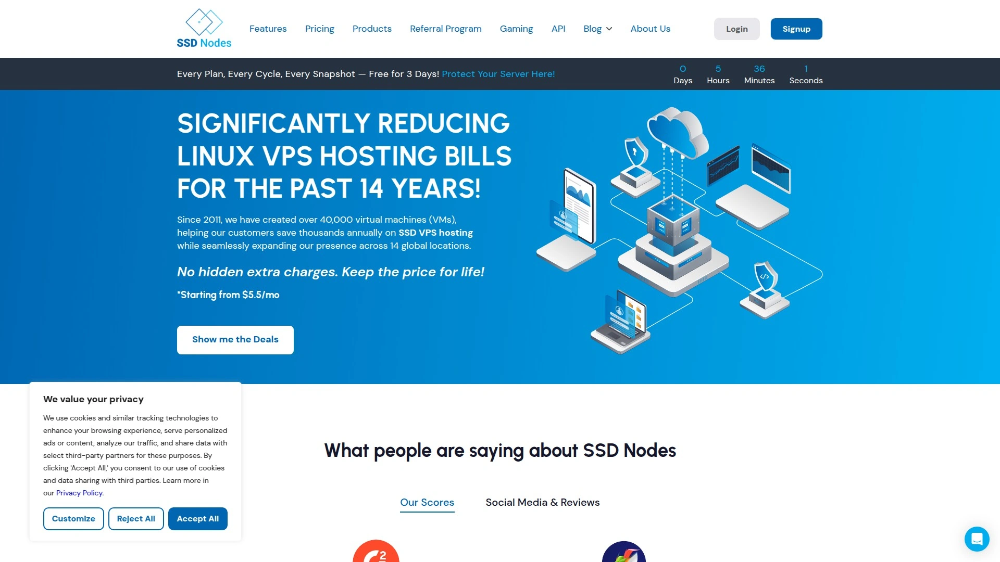

SSD Nodes的模式比较独特，它主要提供基于年付或多年付的大配置VPS方案。通过长期承诺，用户可以用极低的价格获得非常高的硬件配置。

* **特点**：
  * **超高性价比**：在长期套餐下，单位价格非常低。
  * **大配置**：通常提供远超同价位月付方案的内存和存储空间。
  * **14天退款保证**：提供退款保障，降低长期购买的风险。

## **[Vultr](https://www.vultr.com/)**

高性能云服务器，提供全球广泛的节点选择。

Vultr是另一家广受开发者欢迎的云服务器提供商，以其高性能的计算实例和遍布全球的数据中心而闻名。

* **优势**：
  * **高性能硬件**：全线采用高性能的Intel CPU和NVMe SSD。
  * **全球20+数据中心**：可以轻松地在全球范围内启动和扩展应用。
  * **功能丰富**：提供裸金属、块存储、对象存储、负载均衡等多种服务。

## **[Linode](https://www.linode.com/)**

被Akamai收购，提供稳定可靠的开发者云平台。

Linode是一家老牌的云主机提供商，以其简单、强大和可靠的服务赢得了开发者的信赖。被Akamai收购后，进一步整合了其强大的CDN网络能力。

* **特点**：
  * **简单易用**：控制面板设计简洁，上手非常快。
  * **出色的性能**：提供稳定且一致的服务器性能。
  * **可预测的定价**：价格结构简单明了，没有复杂的隐藏费用。

***

## **常见问题 (FAQ)**

**1. 新手如何选择适合自己的VPS主机？**
首先明确你的核心需求：预算是多少、预计网站/应用有多少访问量、自己是否懂技术。一般来说，可以从一个较低配置的方案开始，比如1核CPU、1GB内存，大多数服务商都支持后续平滑升级。

**2. 管理型和非管理型VPS有什么区别？**
管理型(Managed)VPS意味着服务商会帮你处理服务器的日常维护、安全更新和故障排查，省心省力但价格更高。非管理型(Unmanaged)则给你一个纯净的操作系统和完全的控制权，你需要自己负责所有软件的安装和维护，适合有技术能力的用户。

**3. VPS的机房位置重要吗？**
非常重要。选择一个离你目标用户群体最近的数据中心，可以显著降低网络延迟，加快网站的加载速度，提升用户体验。比如，如果你的用户主要在亚洲，选择新加坡或日本的机房会比选择美国的机房效果更好。

***

## **总结**

选择VPS就像给自己找一个“线上的家”，稳定和速度是基础，服务和价格则是决定你住得舒不舒服的关键。这份列表涵盖了从极致性价比到顶级服务的各种选择，希望能帮你拨开云雾，找到最适合你当前需求的那个平台。

如果你是刚入门，或者对成本比较敏感，希望用最低的试错成本来启动项目，那么[RackNerd](#racknerdhttpswwwracknerdcom)凭借其超高的性价比和灵活的全球节点选择，无疑是一个绝佳的起点。
